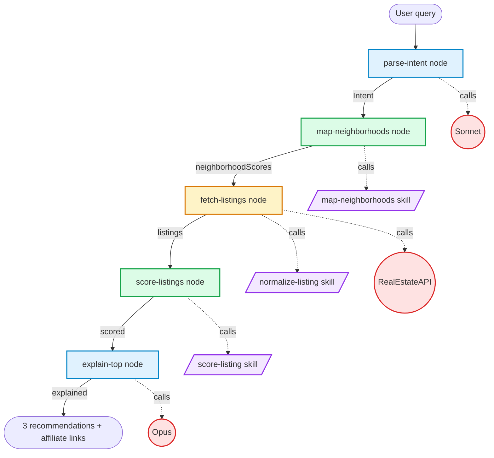
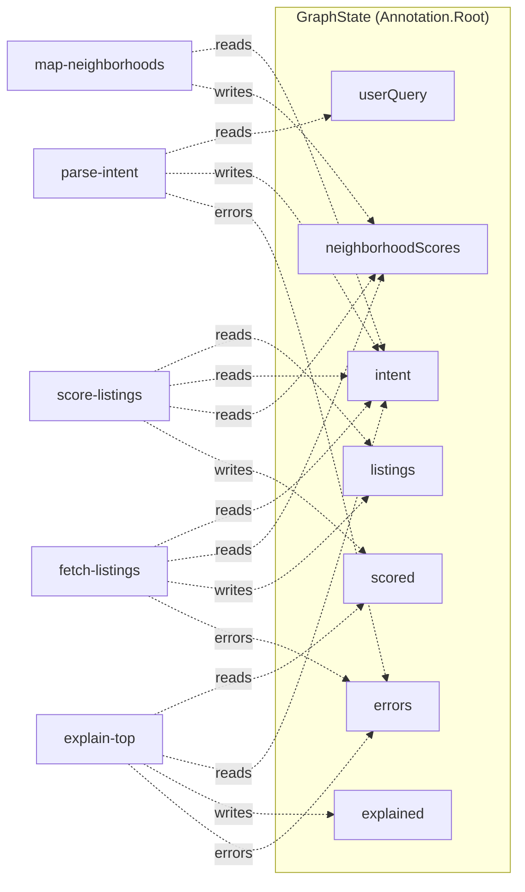

# Architecture

System reference for the housing recommendation app. Diagrams render on GitHub via Mermaid.

## The pipeline

A LangGraph StateGraph chains six stages. Each is a node in the graph. Deterministic logic lives in three skills (pure functions) that nodes call.



**Legend.** Blue = LLM node. Yellow = hybrid (external call plus skill). Green = pure deterministic node. Purple = pure skill. Red = external dependency.

## Components in detail

### LLM nodes (agents)

| Node | Model | Purpose |
|---|---|---|
| `parse-intent` | `claude-sonnet-4-6` | Extracts structured intent from free-text user query |
| `explain-top` | `claude-opus-4-7` | Writes why-it-fits and tradeoffs for the top 3 |

### Deterministic nodes

| Node | Purpose | Calls |
|---|---|---|
| `map-neighborhoods` | Scores each neighborhood for intent fit | `map-neighborhoods` skill |
| `score-listings` | Computes weighted score per listing | `score-listing` skill |

### Hybrid node

| Node | Purpose | Calls |
|---|---|---|
| `fetch-listings` | Pulls and normalizes raw listings | RealEstateAPI client + `normalize-listing` skill |

### The three core skills

These three pure functions are the foundation. If you stripped out the LLM layer, a basic version of the system would still work using static intent and a hardcoded catalog.

1. **`normalize-listing`** — Turns any source's raw listing JSON into the unified `NormalizedListing` shape. Source-aware, returns `null` on malformed input.
2. **`score-listing`** — Weighted score (0 to 100) from intent and neighborhood scores. Components: price 0.30, size 0.20, neighborhood 0.25, amenities 0.15, freshness 0.10.
3. **`map-neighborhoods`** — Scores each neighborhood 0 to 1 from tag overlap, price band fit, and walk/transit fit.

## State flow

State flows through the graph as each node reads some fields and writes others.



Reducer behavior per field:

| Field | Reducer |
|---|---|
| `userQuery` | last-wins |
| `intent` | last-wins |
| `neighborhoodScores` | last-wins |
| `listings` | concat with dedupe by `sourceUrl` |
| `scored` | last-wins |
| `explained` | last-wins |
| `errors` | concat |

## Deployment topology

```mermaid
flowchart TB
    subgraph Browser
        UI[Next.js client React Server Components + useObject]
    end

    subgraph Vercel
        Edge[Edge: rate limit middleware]
        Route[/api/recommend route handler]
        SSR[Server components]
    end

    subgraph Services["External services"]
        Anth[(Anthropic API)]
        REA[(RealEstateAPI.com)]
        WS[(Walk Score API)]
        GP[(Google Places API)]
        MB[(Mapbox tiles)]
    end

    subgraph Data["Data plane"]
        Neon[(Neon Postgres + pgvector + LangGraph checkpointer)]
        Upstash[(Upstash Redis: cache + rate limit)]
    end

    subgraph Obs["Observability"]
        LS[LangSmith traces]
        Sentry[Sentry errors]
        PH[PostHog analytics]
    end

    UI -->|HTTPS| Edge
    Edge -->|allowed| Route
    Route -->|graph.stream| Anth
    Route --> REA
    Route --> WS
    Route --> GP
    Route -->|checkpoints| Neon
    Route -->|cache lookups| Upstash
    Route -.traces.-> LS
    SSR --> UI
    UI -->|tiles| MB
    UI -.errors.-> Sentry
    UI -.events.-> PH
```

All traffic enters through Vercel. The recommend route is `runtime: 'nodejs'` with `maxDuration: 60` because the LangGraph pipeline can take 8 to 30 seconds end-to-end depending on the listings count.

## Skills versus nodes — the rule

A piece of code belongs in `src/skills/` when all three are true:

1. It is a pure function (no I/O, no LLM, no env vars).
2. It is unit-testable with fixture inputs and deterministic outputs.
3. It would still make sense if the agent layer did not exist.

If any condition fails, it belongs in a node, a client, or a query function.

## The aggressively-simplified version

If you stripped this to its core, three skills carry the system:

1. **Listing normalizer** — without this, every listing source is a special case in every consumer.
2. **Scoring engine** — without this, "recommend" has no meaning.
3. **Neighborhood mapper** — without this, you cannot translate "near transit" into actual zip codes.

The five graph nodes become two: one that parses free text into intent, one that calls the three skills in sequence. The LLM explanation layer becomes a templated string. The result is less polished but the recommendation pipeline still works.

This is the right mental model for debugging: when something is wrong, ask which of the three skills is producing bad output, not which agent.

## Reference: file map

```
src/
├─ graph/
│  ├─ state.ts                       Annotation.Root + GraphState type
│  ├─ index.ts                       Compiled graph + invoke() wrapper
│  └─ nodes/
│     ├─ parse-intent.ts             LLM (Sonnet)
│     ├─ map-neighborhoods.ts        Pure (calls skill)
│     ├─ fetch-listings.ts           Hybrid (client + skill)
│     ├─ score-listings.ts           Pure (calls skill)
│     ├─ explain-top.ts              LLM (Opus)
│     └─ prompts/
│        ├─ parse-intent.md
│        └─ explain.md
├─ skills/
│  ├─ normalize-listing.ts           Pure
│  ├─ score-listing.ts               Pure
│  └─ map-neighborhoods.ts           Pure
├─ clients/
│  ├─ anthropic.ts                   ChatAnthropic singletons
│  ├─ real-estate-api.ts
│  ├─ walk-score.ts
│  └─ google-places.ts
├─ types/
│  ├─ intent.ts
│  └─ listing.ts
├─ data/
│  └─ neighborhoods.json
├─ db/
│  ├─ index.ts                       Drizzle pool, shared with checkpointer
│  ├─ schema/
│  └─ queries/
├─ app/
│  ├─ (recommend)/page.tsx           Server component
│  └─ api/
│     └─ recommend/route.ts          SSE stream of graph updates
└─ components/
   ├─ ui/                            shadcn primitives (owned)
   ├─ RecommendFlow.tsx              Client component, useObject hook
   ├─ IntentCard.tsx
   ├─ NeighborhoodMap.tsx            Mapbox GL JS
   ├─ ListingsGrid.tsx
   ├─ ListingCard.tsx
   ├─ RefineChat.tsx                 assistant-ui + LangGraph adapter
   └─ FtcDisclosure.tsx
```
